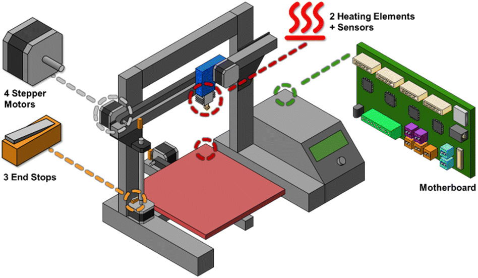

# Hacking 3D Printers as Laboratory Robots

Welcome to the official repository for tracking and updating 3D printer modifications for laboratory use. 

This repository is linked to the review paper:
**"Hacking 3D printers as laboratory robots"** *Sander Baas, Nessa Carson, and Vittorio Saggiomo* *Digital Discovery*, 2026.  
**DOI:** [10.1039/d5dd00451a](https://doi.org/10.1039/d5dd00451a)

## Purpose of this Repository
The world of open-source hardware and 3D printer hacking is moving fast. While the original paper provides a comprehensive overview of the field up to its publication, this repository serves as a **living, community-driven database**. It is designed to keep track of new 3D printer hacks, modifications, and repurposed systems used as lab equipment or robots in the future.

## The Database
The complete and updated list of 3D printer modifications can be found here:
👉 **[View the Hacks Database (hack.md)](hack.md)**

## How to Contribute
We welcome contributions from the community! If you have published a new hack, found a paper we missed, or want to update an existing entry, please submit your changes:

### Option 1: Submit a Pull Request (Recommended)
1. **Fork** this repository.
2. Edit the `hack.md` file to add your entry to the table. Please maintain the existing format: `| name of the device | printer type | Purpose | Device Typo of modification | year | reference |`
3. Ensure the reference includes a direct link to the DOI.
4. **Commit** your changes with a brief description (e.g., `Add [Device Name] by [Author]`).
5. Open a **Pull Request** to the main branch of this repository.

### Option 2: Open an Issue
If you are not comfortable making a Pull Request, you can [open an Issue](../../issues) in this repository. 
Please provide all the necessary information for the table (Device Name, Printer Type, Purpose, Modification Type, Year, and DOI link), and maintainers will add it to the database for you.

---
*Let's keep open-source lab automation accessible and up-to-date!*